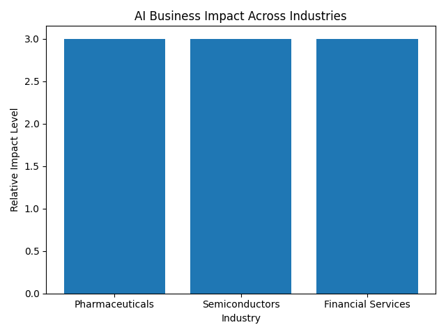

# AI Industry Insights

Welcome to **AI Industry Insights**, an ongoing newsletter series analyzing how emerging artificial intelligence technologies are transforming real-world business decision-making.

## Latest Issue
- **Issue 1 – December 2025**
  - Pharmaceuticals: AI-driven drug discovery
  - Semiconductors: Generative AI for chip design
  - Financial Services: Decision-grade generative AI

## About This Newsletter
This series is produced as part of an academic residency and continued as an independent professional publication. Each issue focuses on emerging AI companies, evolving products, and measurable business impact.

## Author
Timothy Quainoo
